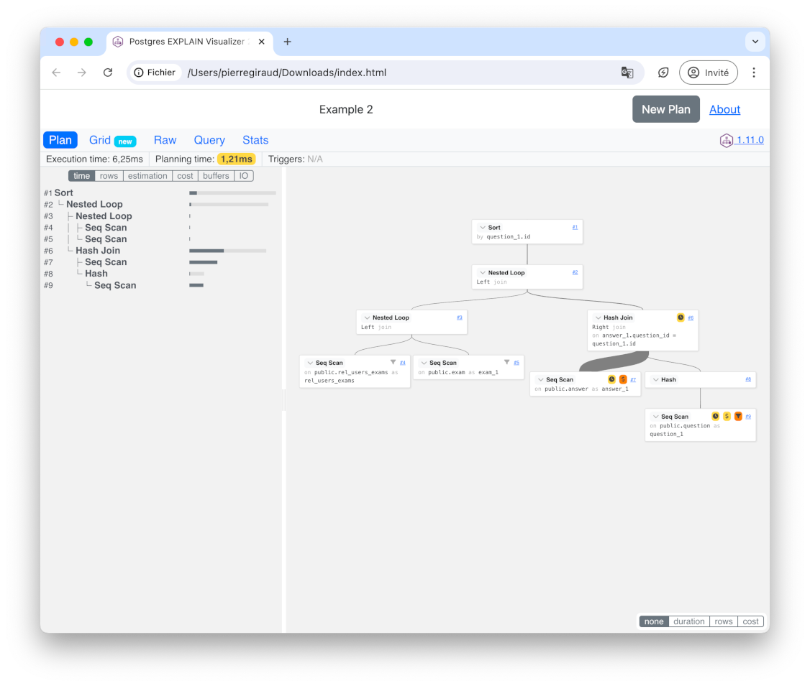

PEV2: A VueJS component to show a graphical vizualization of a PostgreSQL execution
plan.



# Usage

To use the explain vizualizer you can choose one of the following options:

## Dalibo service (recommended)

[explain.dalibo.com](https://explain.dalibo.com)

This service is provided by `Dalibo` and can help you to share your plans with
colleagues or customers.

## All-in-one local (no installation, no network)

PEV2 can be run locally without any external internet resource.

Simply download
[pev2.html](https://www.github.com/dalibo/pev2/releases/latest/download/pev2.html),
open it in your favorite internet browser.

## Integrated in a web application

### Without building tools

```html
<script src="https://unpkg.com/vue@3/dist/vue.global.prod.js"></script>
<script src="https://unpkg.com/pev2/dist/pev2.umd.js"></script>
<link
  href="https://unpkg.com/bootstrap@5/dist/css/bootstrap.min.css"
  rel="stylesheet"
/>
<link rel="stylesheet" href="https://unpkg.com/pev2/dist/pev2.css" />

<div id="app" class="d-flex flex-column vh-100">
  <pev2 :plan-source="plan" plan-query="" />
</div>

<script>
  const { createApp } = Vue

  const plan = `
    Aggregate  (cost=12.50..12.51 rows=1 width=8)
      ->  Seq Scan on employees  (cost=0.00..10.00 rows=1000 width=0)
  `;

  const app = createApp({
    data() {
      return {
        plan: plan,
      }
    },
  })
  app.component("pev2", pev2.Plan)
  app.mount("#app")
</script>
```

[See it live](https://stackblitz.com/edit/pev2-vanilla).

### With build tools

PEV2 can be integrated as a component in a web application.

Install it:

```
npm install pev2
```

Declare the `PEV2` component and use it:

```javascript
import { Plan } from "pev2"
import "pev2/dist/pev2.css"

export default {
  name: "PEV2 example",
  components: {
    pev2: Plan,
  },
  data() {
    return {
      plan: plan,
      query: query,
    }
  },
}
```

Then add the `PEV2` component to your template:

```html
<div id="app">
  <pev2 :plan-source="plan" :plan-query="query"></pev2>
</div>
```

`PEV2` requires `Bootstrap (CSS)` to work so don't forget to
add the following in you header (or load them with your favorite bundler).

```html
<link
  href="https://unpkg.com/bootstrap@5/dist/css/bootstrap.min.css"
  rel="stylesheet"
/>
```

[See it live](https://stackblitz.com/edit/pev2-vite).

# Disclaimer

This project is a rewrite of the excellent [Postgres Explain Visualizer
(pev)][pev]. Kudos go to [Alex Tatiyants][atatiyan].

The [pev][pev] project was initialy written in early 2016 but seems to be
abandoned since then. There was no activity at all for more than 3 years and
counting though there are several issues open and relevant pull requests
pending.

[pev]: https://github.com/AlexTatiyants/pev
[atatiyan]: https://github.com/AlexTatiyants
[demo]: https://dalibo.github.io/pev2
[explain.dali.bo]: https://explain.dalibo.com
